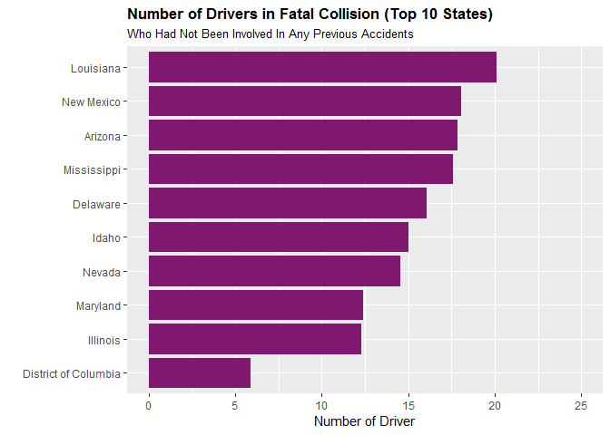

Road accident is one of the leading cause of deaths globally. Specifically in the US, an average of 102 people per day were killed in motor vehicle accidents according to 2016 National Highway Traffic Safety Administration (NHTSA) data. Coupled with the increasing amount of driving, traffic related-fatalities death is increasing at an alarming rate.

By analyzing the demographics of victims involved in traffic accidents in each state, a pattern may be identified, and a action plan may be developed based on the insights extracted from the dataset.

The bad\_driver dataset released by FiveThirtyEight that was orginally collected by the NHTSA is used for this study. The original analysis of this dataset to identify the state with the worst drivers can be found [here](https://fivethirtyeight.com/features/which-state-has-the-worst-drivers/). The Datacamp [Reducing Traffic Mortaility in the USA](https://www.datacamp.com/projects/464) project is used as a guideline for this analysis here.

``` r
driver<-fivethirtyeight::bad_drivers
```

The dataset contains 8 variables, as shown below. There are 51 observations, one for each state.

-   **state** 51 states in the US
-   **num\_drivers** Number of drivers involved in fatal collisions per billion miles
-   **perc\_speed** Percentage Of Drivers Involved In Fatal Collisions Who Were Speeding
-   **perc\_alcohol** Percentage Of Drivers Involved In Fatal Collisions Who Were Alcohol-Impaired
-   **perc\_not\_distracted** Percentage Of Drivers Involved In Fatal Collisions Who Were Not Distracted
-   **perc\_no\_previous** Percentage Of Drivers Involved In Fatal Collisions Who Had Not Been Involved In Any Previous Accidents
-   **insurance\_premiums** Car Insurance Premiums ($)
-   **losses** Losses incurred by insurance companies for collisions per insured driver ($)

<!-- -->

    ## # A tibble: 6 x 8
    ##   state num_drivers perc_speeding perc_alcohol perc_not_distra~
    ##   <chr>       <dbl>         <int>        <int>            <int>
    ## 1 Alab~        18.8            39           30               96
    ## 2 Alas~        18.1            41           25               90
    ## 3 Ariz~        18.6            35           28               84
    ## 4 Arka~        22.4            18           26               94
    ## 5 Cali~        12              35           28               91
    ## 6 Colo~        13.6            37           28               79
    ## # ... with 3 more variables: perc_no_previous <int>,
    ## #   insurance_premiums <dbl>, losses <dbl>

    ##     state            num_drivers    perc_speeding    perc_alcohol  
    ##  Length:51          Min.   : 5.90   Min.   :13.00   Min.   :16.00  
    ##  Class :character   1st Qu.:12.75   1st Qu.:23.00   1st Qu.:28.00  
    ##  Mode  :character   Median :15.60   Median :34.00   Median :30.00  
    ##                     Mean   :15.79   Mean   :31.73   Mean   :30.69  
    ##                     3rd Qu.:18.50   3rd Qu.:38.00   3rd Qu.:33.00  
    ##                     Max.   :23.90   Max.   :54.00   Max.   :44.00  
    ##  perc_not_distracted perc_no_previous insurance_premiums     losses      
    ##  Min.   : 10.00      Min.   : 76.00   Min.   : 642.0     Min.   : 82.75  
    ##  1st Qu.: 83.00      1st Qu.: 83.50   1st Qu.: 768.4     1st Qu.:114.64  
    ##  Median : 88.00      Median : 88.00   Median : 859.0     Median :136.05  
    ##  Mean   : 85.92      Mean   : 88.73   Mean   : 887.0     Mean   :134.49  
    ##  3rd Qu.: 95.00      3rd Qu.: 95.00   3rd Qu.:1007.9     3rd Qu.:151.87  
    ##  Max.   :100.00      Max.   :100.00   Max.   :1301.5     Max.   :194.78

Bar plots of the top 10 states with the highest number of the fatalities under different conditions are shown below. 

To further explore the structure and characteristics of the variables, we can use histogram, and the pairwise relationship between each variable is shown using a scatterplot matrix. The output from `ggpairs()` below shows a scatterplot matrix as well as the correlation between the variables.

``` r
plot_histogram(driver)
```


``` r
driver %>% 
  select(-state, -insurance_premiums, -losses) %>%
  ggpairs()
```


Looking at the correlation coefficients (*ρ*), though there is not any strong correlations between the variables (*ρ* &gt; 0.8 for strong correlation), we can see that traffic-related fatality associates the most with being alcohol-impaired. Being alcohol-impaired is positively associated with speeding. These two conditions are indicators for drivers with bad behaviors. In addition, being alcohol impaired is negatively associated with drivers with no previous accident.

To further study the relationship between traffic fatality and the causes, a multiple linear regression model with the total number of fatalities as the response variable is built. A multiple regression model allows us to find the association of the target with each conditions adjusting for the other conditions.

The multiple linear regression model is shown as follow.

`num driver = 8.333 - 0.0432 speeding + 0.192 alcohol +0.00592 not distracted + 0.0274 no previous`

Note that the coefficient related to drivers with no previous accidents is positive in the regression model, while its correlation coefficient is negative with the response variable. This indicates the no previous accident variable may have a masking relationship with one other variable.

To further inspect the relationship between the variable visually, the dimension of the dataset needs to be reduced. Here, we will use principal component analysis (PCA) to cluster the data. Prior to performing PCA, the dataset is standardized so the variables are on the same scale.

The first two principal components (PC) explains 62.55% of the variation in the predictors, while the first three explains about 85.76%. Next, scatter plot between the principal components can be examined to identify any potential clusters.

    ## Importance of components:
    ##                           Comp.1    Comp.2    Comp.3    Comp.4
    ## Standard deviation     1.1943110 1.0132399 0.9539522 0.7473352
    ## Proportion of Variance 0.3637266 0.2617971 0.2320563 0.1424200
    ## Cumulative Proportion  0.3637266 0.6255236 0.8575800 1.0000000

We first look at a scatter plot of the first two PCs, and 3D plot of the the first three PCs. There are no obvious clusters observed. [K means clustering](https://towardsdatascience.com/k-means-clustering-from-a-to-z-f6242a314e9a) is used next. 

Like in PCA, the quantitative variables are also first standardized. The number of clusters, or k, will be determined by evaluating the inertia, which tells us how far aprt the points are within a cluster. k from 1 to 10 are evaluated here. As the number of clusters increases, the inertia decreases.

The inertia at each k is plotted. The elbow in this plot is generally used as an indicator a higher number of clusters does not decrease the inertia significantly. However, looking at the plot we have below, there is not a clear eblow. Two to four clusters seem to be a reasonable choice.


Using the four clusters determined with K-means, we can then go back to the PCA plots. We can color the observations by their assigned cluster. Two states are assigned to cluster 1 as shown in the plots. It's not immediately clear why those two states are assigned to a different cluster looking at the scatter of the first two principal components. It can be seen that those two states are similar in PC3.


The map below shows the where the clusters are located on a map. Most of the states in cluster 2 are on west coast. Cluster 3 states are on the north and south central and east side, and cluster 4 states are mostly in the middle (plus Florida). The 2 states in cluster 1 are Wisconsin and Mississippi. Note that Hawaii (cluster 3) and Alaska (cluster 2) are not shown in the map here.

``` r
state.cluster<- data.frame(state=tolower(driver$state), cluster=clusters)
usa_map <- map_data("state")
ggplot() +
  geom_map(data=usa_map, map=usa_map,
                    aes(long, lat, map_id=region),
                    color="#2b2b2b", size=0.15, fill=NA)+
  geom_map(data=state.cluster, map=usa_map,
                    aes(fill=cluster, map_id=state),
                    color="#2b2b2b", size=0.15) +
  scale_color_identity() +
  coord_map("polyconic") +
  ggthemes::theme_map()
```


We can now take a look at the characteristics of each cluster.The average number of drivers invloved in a fatal traffic accident are similar for each cluster. The percent of drivers not distracted for cluster 1 is substantially lower than that of the others, indicating distracted driving could be a major area in combating traffic fatality in those states. Speeding and drunk driving appear to be the main concerns in cluster 4 states. Cluster 3 states have the lowest fatalities under different conditions overall. For cluster 2 states, while alcohol is not main contributing cause, speeding should be main focus. In addition, cluster 2 states also have the highest percentage of drivers involved in fatal accidents who did not have any previous traffic accidents. This suggests that the drivers involved generally may have been be good drivers, and may not have been at fault. Alternatively, those could be young drivers who had short driving records.

    ## # A tibble: 4 x 6
    ##   cluster mean.driver mean.speeding mean.alcohol mean.noDist mean.noPrev
    ##   <fct>         <dbl>         <dbl>        <dbl>       <dbl>       <dbl>
    ## 1 1              15.7          25.5         32          24.5        92  
    ## 2 2              14.7          34.1         28.4        85.5        95.9
    ## 3 3              15.8          21.7         28          89.1        85.3
    ## 4 4              16.8          38.9         35.2        90.8        84.2


We can also revisit the barplots at the beginning, and color the states by their assigned cluster.


